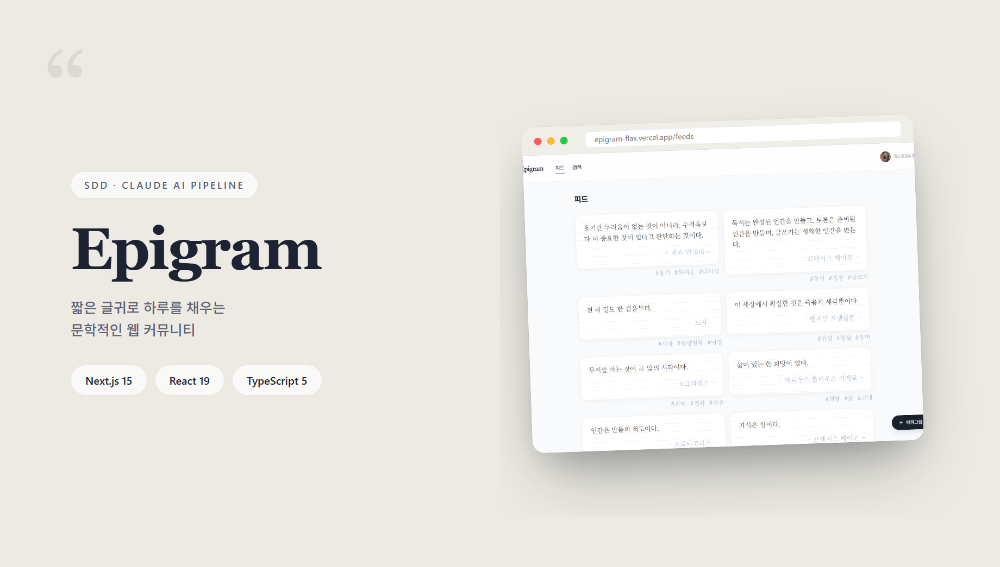
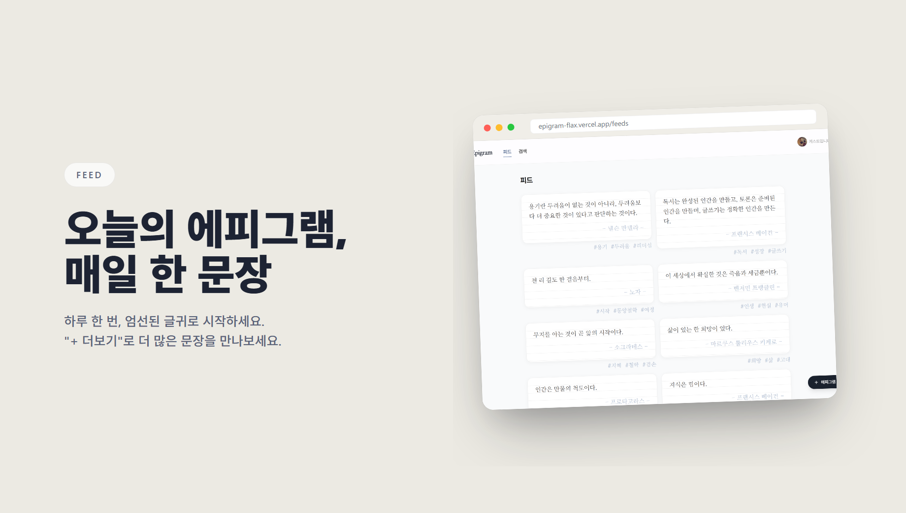
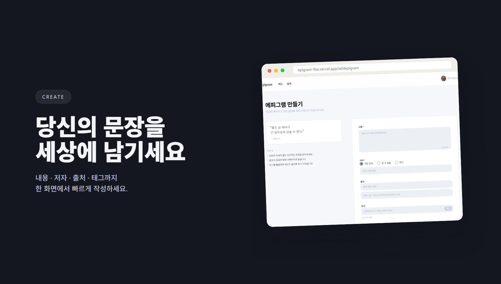
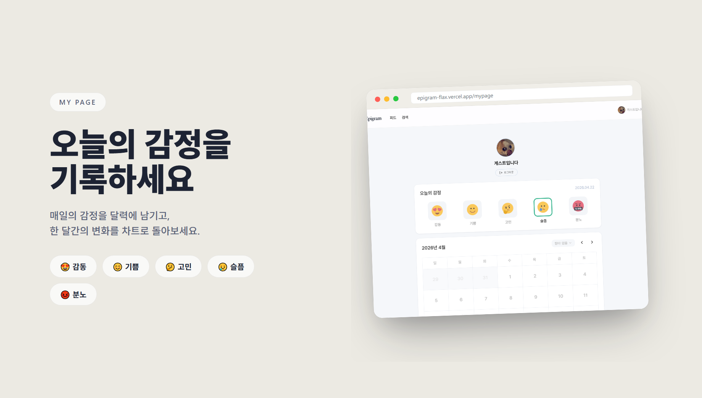

 

 
 

# 📖 Epigram

    

 

**📖 짧은 글귀로 하루를 채우는 문학적인 웹 커뮤니티, Epigram**

[React Native 기반 앱 버전](https://github.com/burningddol/epigram-mobile)과 디자인 시스템 · API 레이어를 공유합니다.

 

별도 설치 없이 **웹 브라우저** 또는 **Expo Go 앱**으로 바로 실행해볼 수 있어요.

  
또는

1. App Store · Play Store 에서 **Expo Go** 설치
2. 아래 QR을 Expo Go 로 스캔

 

 

오늘의 에피그램과 최신 글을 카드 그리드로 만날 수 있어요.

 

 

여러분의 문장을 세상에 남겨보세요.

내용 · 저자 · 출처에 태그까지 한 화면에서 빠르게 작성하도록 설계했어요.

 

 

매일의 감정을 달력에 기록하고, 한 달간의 변화를 차트로 돌아볼 수 있어요.

5가지 감정(감동 · 기쁨 · 고민 · 슬픔 · 분노)을 각각의 색상으로 구분해 감정 비율을 한눈에 시각화합니다.

 

 

## 😎 Development Description

- **Spec-Driven Development**: [speckit](https://github.com/github/spec-kit)으로 6개 사용자 스토리 · 55개 인수 시나리오 · BFF 계약을 코드 작성 전에 문서화했어요.
- **Claude AI 개발 파이프라인**: `CLAUDE.md` + `.specify/memory/constitution.md`로 AI 에이전트의 워크플로우(이슈 생성 → 브랜치 → 구현 → simplify 리팩토링 → CI 통과 후 머지)를 자동화해 1인 개발에서도 팀 수준의 품질 게이트를 유지했어요.
- **BFF 프록시 보안 패턴**: JWT를 HttpOnly 쿠키로 격리해 클라이언트 JavaScript에 절대 노출하지 않는 구조를 설계했어요. 401 자동 갱신 + ISR 캐시 분리까지 다뤘어요.
- **FSD(Feature-Sliced Design)** 아키텍처로 `app → views → widgets → features → entities → shared` 단방향 의존성을 강제했어요.
- **렌더링 전략 분리**: 공개 데이터는 ISR(서버 컴포넌트 직접 fetch)로, 인증 데이터는 CSR(React Query + BFF)로 분리해 캐싱과 보안을 동시에 챙겼어요.
- **React Hook Form + Zod**로 런타임 검증 기반의 타입 안전한 폼을 구성했어요.

 

 

## 🧑🏻‍💻 Developer

| 개발자      | GITHUB                                                           |
| ----------- | ---------------------------------------------------------------- |
| burningddol | [https://github.com/burningddol](https://github.com/burningddol) |
